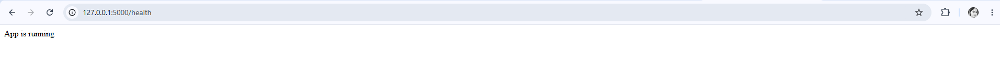
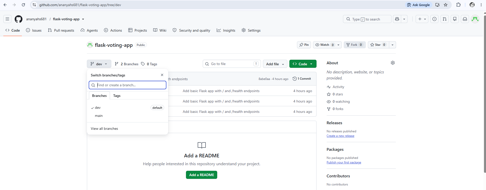
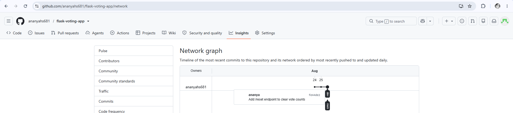

# Flask Voting App

## Project Description

This is a simple web-based voting application built with Python and Flask. It lets you cast a vote for any candidate by visiting a URL, and view the live vote counts for everyone who has been voted for so far. Votes are stored in memory while the server is running, and there's an endpoint to reset all counts back to zero.

## Installation and Setup

Follow these steps in order to run the project on your own machine:

```bash
# 1. Clone the repository
git clone https://github.com/ananyahs681/flask-voting-app.git
cd flask-voting-app

# 2. Create and activate a virtual environment
python3 -m venv venv
source venv/bin/activate        # On Windows: venv\Scripts\activate

# 3. Install dependencies
pip install flask

# 4. Run the app
python app.py
```

The server will start at `http://127.0.0.1:5000`.

## API Endpoint Reference

| Endpoint | Method | Description | Example Response |
|---|---|---|---|
| `/` | GET | Welcome message | `Welcome to the App` |
| `/health` | GET | Confirms the server is running | `App is running` |
| `/vote/<name>` | GET | Records one vote for `<name>`. First-time names start at 1, existing names increment. | `Vote recorded for alice. Total votes: 3` |
| `/results` | GET | Returns current vote counts for all candidates as JSON | `{"alice": 3, "bob": 1}` |
| `/reset` | GET | Clears all vote counts | `{"msg": "All votes have been reset"}` |

## Git Workflow

This project follows a `dev` → `main` branching workflow:

- All development happens on the `dev` branch first
- Once a feature is complete and tested locally, `dev` is merged into `main`
- `main` only ever contains stable, working code — nothing is committed to it directly

```
dev:   [Task 1: / and /health] ──▶ merged into main ──▶ Version 1
dev:   [/vote, /results] ──▶ [/reset] ──▶ merged into main ──▶ Version 2
```

Each version was released by pushing `dev`, then checking out `main`, merging `dev` into it, and pushing `main` — so the commit history on `main` clearly shows Version 2 built directly on top of Version 1, not rewritten from scratch.

## Version History

| Version | What was included |
|---|---|
| **Version 1** | Basic Flask app with `/` and `/health` endpoints |
| **Version 2** | Added the voting feature (`/vote/<name>`, `/results`) and a `/reset` endpoint to clear vote counts |

## Screenshots

**Application running in the browser:**



**GitHub repository showing `dev` and `main` branches:**



**Commit/merge history showing Version 1 and Version 2 releases:**

